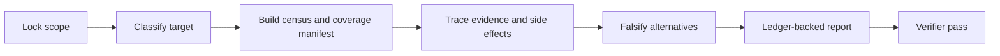

<h1 align="center">System Audit Review</h1>
<p align="center"><strong>MAIDUY / Evidence before conclusions.</strong></p>
<p align="center">A portable, read-only forensic audit skill for systems that are too important to review by impression.</p>
<p align="center">
  <a href="https://github.com/MaiDuy708/system-audit-review/actions/workflows/validate.yml"></a>
  <a href="https://github.com/MaiDuy708/system-audit-review/releases"></a>
  <a href="LICENSE"></a>
</p>

## The Standard

Most reviews stop at a scan result or a plausible explanation. This skill requires a decision-grade audit: a measured asset census, direct evidence for every material claim, end-to-end side-effect traces, explicit negative-space checks, and a report that names what remains unreviewed.

It is designed for repositories, services, runtime workspaces, data pipelines, security boundaries, automations, and operational workflows, particularly when they are large, mixed, stateful, or risky.



## What It Covers

| Layer | Required evidence |
|---|---|
| File census | Footprint, file classes, executable files, symlinks, and outliers |
| Change control | Repository state, history exposure, ignored-secret rules, and drift |
| Runtime and config | Live processes, schedulers, source-of-truth config, and shadow copies |
| Dependencies and tests | Manifests, vendors, static checks, and untested high-consequence paths |
| Credentials | Permissions, tracked material, backup inclusion, and false positives |
| Side effects | Trigger, validation, submit, durable commit, readback, recovery, and alerting |
| Negative space | Stale artefacts, intended exclusions, child processes, and rejected hypotheses |

For a large target, the skill blocks a final report until every applicable layer is covered or explicitly marked blocked, unreviewed, or not applicable.

## Output Contract

A large-target report includes:

- Target classification and asset census
- Coverage manifest and checks run
- Claim-evidence ledger with evidence labels
- Findings ordered by severity and a sparse failure matrix
- Write receipt states, rejected hypotheses, and open blockers
- Testable remediation roadmap, chaos tests, and verifier outcome

An exit code, a log line, an HTTP acknowledgement, or a successful function call is never treated as business success without contract-required readback.

## Install

| Agent | Command |
|---|---|
| Codex | `python3 ~/.codex/skills/.system/skill-installer/scripts/install-skill-from-github.py --repo MaiDuy708/system-audit-review --path .` |
| OpenClaw | `openclaw skills install git:MaiDuy708/system-audit-review` |
| Gemini CLI | `gemini skills install https://github.com/MaiDuy708/system-audit-review` |
| Claude Code | `claude plugin marketplace add MaiDuy708/system-audit-review` then `claude plugin install system-audit-review@maiduy-system-audit-review` |

Inspect third-party skills before installation. A skill can influence agent behavior and access local tools and files.

## Use It

Invoke the skill when the request needs more than surface-level code commentary:

```text
Audit this workspace read-only. It is 4 GB, contains source, runtime state,
backups, credentials, and schedulers. Produce a forensic report with a coverage
manifest and evidence ledger. Do not change anything.
```

The skill defaults to read-only. It does not mutate the target, live runtime state, configuration, services, external systems, or credentials unless the user explicitly authorizes that exact mutation.

## Repository Layout

```text
SKILL.md                         Agent-facing workflow and hard boundaries
references/audit-protocol.md     Forensic checklist, receipt semantics, and gates
agents/openai.yaml               Codex display metadata
.claude-plugin/                  Claude Code plugin and marketplace metadata
scripts/validate.py              Dependency-free repository integrity checks
.github/                         CI, dependency updates, ownership, and issue intake
```

## Release Policy

Releases are tagged after the validator passes and the supported-agent installation paths are checked. `0.x` releases are production-usable but may refine workflow shape; `1.0.0` requires independent behavioral evaluation, not only structural validation.

## Contributing And Security

See [CONTRIBUTING.md](CONTRIBUTING.md) for the evidence standard for changes and [SECURITY.md](SECURITY.md) for responsible disclosure. The project is licensed under [MIT](LICENSE).

## Brand And Provenance

**MAIDUY** is the publisher mark for maintained releases. It is an attribution and provenance signal, not a claim of registered trademark status. Modified distributions must use a distinct identity and state their relationship to this repository. Details: [BRAND.md](BRAND.md).
