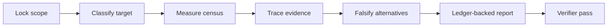

<h1 align="center">System Audit Review</h1>
<p align="center"><strong>MAIDUY / Evidence before conclusions.</strong></p>
<p align="center">A portable, read-only forensic audit skill for systems that are too important to review by impression.</p>
<p align="center">
  <a href="https://github.com/MaiDuy708/system-audit-review/actions/workflows/validate.yml"></a>
  <a href="https://github.com/MaiDuy708/system-audit-review/releases"></a>
  <a href="LICENSE"></a>
</p>

<p align="center">
  
</p>

## Why This Exists

Large systems do not fail because an audit missed one obvious file. They fail at seams: a backup silently carries credentials, a scheduler writes to the wrong authority, a timeout is mistaken for a completed side effect, or a clean test suite hides an untraced production path.

`system-audit-review` turns a vague request to “review everything” into an evidence contract. It forces the agent to classify the target, measure coverage, trace material writes end-to-end, falsify plausible alternatives, and state what it could not review.

| Without this skill | With this skill |
|---|---|
| A short list of opinions | A claim-evidence ledger with confidence and resolving probes |
| “The scan passed” | Census, coverage manifest, and negative-space checks |
| HTTP 200 treated as success | Durable readback and explicit receipt states |
| Causal stories inferred from similarity | Sparse failure matrix with proven edges only |
| “Whole system reviewed” | Every blocked or unreviewed material layer named |

## The Audit Flightpath



The protocol covers seven evidence layers: file census, change control, runtime/config drift, dependency and test surface, credentials, material side effects, and negative space.

## Operating Model (v0.2)

The skill runs as three tiers with an explicit enforced/advisory split:

- **Brain** — `SKILL.md` + `references/audit-protocol.md`. Advisory prose that teaches the method.
- **Sensors** — `scripts/probes/`. Read-only scripts that *generate facts* as JSON so evidence is real tool output, not recall.
- **Gate** — `scripts/audit_gate.py`. Scores the report and exits non-zero if it is structurally incomplete, vague, leaks a secret, cites a probe that never ran, or fails to flag an inference finding for a human.

A portable skill cannot lock an agent's control loop, and this repository does not pretend to. The teeth are the probes' output and the gate's exit code. What the gate cannot judge — whether an inference finding is *substantively* correct — is deliberately pushed into a loud `NEEDS HUMAN/ADVISOR` block.

**Security is extended verify, not a separate cage.** Target content is untrusted DATA, never an instruction; findings carry a trust-provenance axis alongside the evidence-label; probes never execute the target (they read `.git` and code as data, so running the audit cannot be turned into RCE via a hostile `.git/config`); and the recommended posture is a disposable, credential-free, network-denied environment with the target mounted read-only.

## Native Installation

Use the native command for your agent. No download wrapper is required.

### Claude Code

```bash
claude plugin marketplace add MaiDuy708/system-audit-review@v0.2.0
claude plugin install system-audit-review@maiduy-system-audit-review
```

### Codex

```bash
codex plugin marketplace add MaiDuy708/system-audit-review --ref v0.2.0
codex plugin add system-audit-review --marketplace maiduy-system-audit-review
```

### OpenClaw

```bash
openclaw plugins install system-audit-review --marketplace https://github.com/MaiDuy708/system-audit-review.git --force
```

### Gemini CLI

```bash
gemini skills install https://github.com/MaiDuy708/system-audit-review.git --path . --scope user --consent
```

Claude Code and Codex use immutable `v0.2.0` marketplace refs. OpenClaw and Gemini CLI currently install from the repository default branch because their native plugin/skill commands accept no git ref flag.

The optional [installer script](scripts/install.sh) remains for unattended automation and supports a custom source ref through `SYSTEM_AUDIT_REVIEW_REF`.

```bash
SYSTEM_AUDIT_REVIEW_REF=main bash install.sh claude
```

## Release Package

Every release includes a self-contained `.skill` archive and matching SHA-256 file for air-gapped transfer or Gemini CLI installation:

```bash
gemini skills install ./system-audit-review-<version>.skill --scope user
shasum -a 256 -c system-audit-review-<version>.skill.sha256
```

The archive is built from the tagged repository state, excludes `.git`, and is validated by Gemini CLI before upload. See [Releases](https://github.com/MaiDuy708/system-audit-review/releases).

## What It Delivers

For a large target, the final report must include:

- Target classification, asset census, coverage manifest, and checks run
- Claim-evidence ledger with direct references and evidence labels
- Findings, sparse failure matrix, receipt states, and rejected hypotheses
- Open blockers, unreviewed material, testable remediation, and verifier outcome

An exit code, a log line, an HTTP acknowledgement, or a successful function call is never treated as business success without contract-required readback.

## Use It

```text
Audit this workspace read-only. It is 4 GB and contains source, runtime state,
backups, credentials, and schedulers. Produce a forensic report with a coverage
manifest and evidence ledger. Do not change anything.
```

The skill defaults to read-only. It does not mutate the target, runtime state, configuration, services, external systems, or credentials unless the user explicitly authorizes that exact mutation.

## Agent Support

| Agent | Native distribution surface | Pre-release install check |
|---|---|---|
| Codex | Plugin marketplace | Manual marketplace add and plugin install |
| Claude Code | Plugin marketplace | `claude plugin validate` plus manual install |
| OpenClaw | Plugin marketplace bundle | Manual plugin install and skill visibility check |
| Gemini CLI | Git/local `.skill` archive | Manual install and discovery check |

Automated CI (`validate.yml`) enforces the same checks on every push: structural validation, the `audit_gate` self-test, release-script syntax, and a probe compile-check. It does **not** install into any agent — the per-agent install checks above are run manually before a release is tagged.

## Repository Layout

```text
SKILL.md                         Agent-facing workflow and hard boundaries (law)
references/audit-protocol.md     Method, operating model, and security posture
references/audit-contract.md     Machine-checkable report + probe-output contract
scripts/probes/                  Read-only fact-generating probes (census, git_state, scan_orchestrate)
scripts/audit_gate.py            Deterministic report verifier (treats the report as untrusted)
scripts/schemas/                 JSON schema for probe output
tests/fixtures/                  Good + spoofed reports for the gate self-test
scripts/install.sh               One-command installer for one selected agent
scripts/package.sh               Reproducible .skill release archive builder
scripts/validate.py              Dependency-free repository integrity + gate self-test
.claude-plugin/                  Claude Code plugin and marketplace metadata
.github/                         CI, dependency updates, ownership, and issue intake
```

## Release Policy

Releases are tagged only after CI structural validation and the `audit_gate` self-test pass, package artifact validation, and manual supported-agent installation checks. `0.x` releases are production-usable but may refine workflow shape; `1.0.0` requires independent behavioral evaluation, not only structural validation.

## Contributing, Security, And Brand

See [CONTRIBUTING.md](CONTRIBUTING.md) for the evidence standard for changes and [SECURITY.md](SECURITY.md) for responsible disclosure. The project is licensed under [MIT](LICENSE).

**MAIDUY** is the publisher mark for maintained releases. It is an attribution and provenance signal, not a claim of registered trademark status. Modified distributions must use a distinct identity and state their relationship to this repository. Details: [BRAND.md](BRAND.md).
