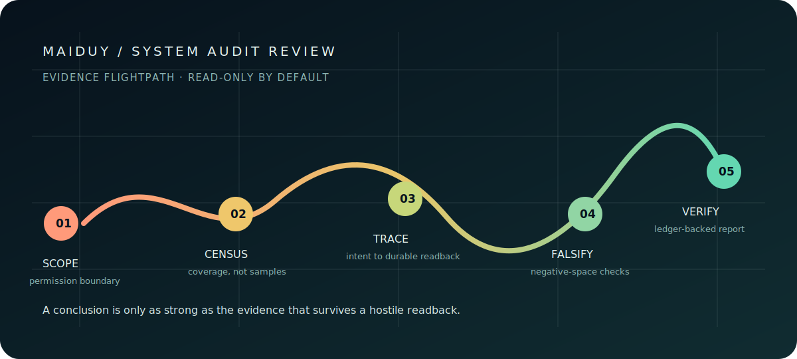
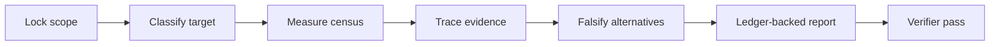

<h1 align="center">System Audit Review</h1>
<p align="center"><strong>MAIDUY / Evidence before conclusions.</strong></p>
<p align="center">A portable, read-only forensic audit skill for systems that are too important to review by impression.</p>
<p align="center">
  <a href="https://github.com/MaiDuy708/system-audit-review/actions/workflows/validate.yml"></a>
  <a href="https://github.com/MaiDuy708/system-audit-review/releases"></a>
  <a href="LICENSE"></a>
</p>

<p align="center">
  
</p>

## Why This Exists

Large systems do not fail because an audit missed one obvious file. They fail at seams: a backup silently carries credentials, a scheduler writes to the wrong authority, a timeout is mistaken for a completed side effect, or a clean test suite hides an untraced production path.

`system-audit-review` turns a vague request to “review everything” into an evidence contract. It forces the agent to classify the target, measure coverage, trace material writes end-to-end, falsify plausible alternatives, and state what it could not review.

| Without this skill | With this skill |
|---|---|
| A short list of opinions | A claim-evidence ledger with confidence and resolving probes |
| “The scan passed” | Census, coverage manifest, and negative-space checks |
| HTTP 200 treated as success | Durable readback and explicit receipt states |
| Causal stories inferred from similarity | Sparse failure matrix with proven edges only |
| “Whole system reviewed” | Every blocked or unreviewed material layer named |

## The Audit Flightpath



The protocol covers seven evidence layers: file census, change control, runtime/config drift, dependency and test surface, credentials, material side effects, and negative space.

## Install In One Command

Run the line for the agent you use. Claude Code, Codex, and OpenClaw use their native plugin marketplaces; Gemini CLI uses its native agent-skill installer.

### Claude Code

```bash
curl -fsSL https://raw.githubusercontent.com/MaiDuy708/system-audit-review/v0.1.4/scripts/install.sh | bash -s -- claude
```

### Codex

```bash
curl -fsSL https://raw.githubusercontent.com/MaiDuy708/system-audit-review/v0.1.4/scripts/install.sh | bash -s -- codex
```

### OpenClaw

```bash
curl -fsSL https://raw.githubusercontent.com/MaiDuy708/system-audit-review/v0.1.4/scripts/install.sh | bash -s -- openclaw
```

### Gemini CLI

```bash
curl -fsSL https://raw.githubusercontent.com/MaiDuy708/system-audit-review/v0.1.4/scripts/install.sh | bash -s -- gemini
```

For inspection before execution, download the script first:

```bash
curl -fsSLO https://raw.githubusercontent.com/MaiDuy708/system-audit-review/v0.1.4/scripts/install.sh
less install.sh
bash install.sh claude
```

The Claude, Codex, and Gemini installers default to this release tag. Override the source ref when testing a newer branch or a fork. OpenClaw's plugin marketplace installer tracks the repository default branch because its current CLI accepts no marketplace ref.

```bash
SYSTEM_AUDIT_REVIEW_REF=main bash install.sh claude
```

## Release Package

Every release includes a self-contained `.skill` archive and matching SHA-256 file for air-gapped transfer or Gemini CLI installation:

```bash
gemini skills install ./system-audit-review-<version>.skill --scope user
shasum -a 256 -c system-audit-review-<version>.skill.sha256
```

The archive is built from the tagged repository state, excludes `.git`, and is validated by Gemini CLI before upload. See [Releases](https://github.com/MaiDuy708/system-audit-review/releases).

## What It Delivers

For a large target, the final report must include:

- Target classification, asset census, coverage manifest, and checks run
- Claim-evidence ledger with direct references and evidence labels
- Findings, sparse failure matrix, receipt states, and rejected hypotheses
- Open blockers, unreviewed material, testable remediation, and verifier outcome

An exit code, a log line, an HTTP acknowledgement, or a successful function call is never treated as business success without contract-required readback.

## Use It

```text
Audit this workspace read-only. It is 4 GB and contains source, runtime state,
backups, credentials, and schedulers. Produce a forensic report with a coverage
manifest and evidence ledger. Do not change anything.
```

The skill defaults to read-only. It does not mutate the target, runtime state, configuration, services, external systems, or credentials unless the user explicitly authorizes that exact mutation.

## Agent Support

| Agent | Native distribution surface | Verification in this repository |
|---|---|---|
| Codex | Plugin marketplace | Isolated marketplace add and plugin install |
| Claude Code | Plugin marketplace | `claude plugin validate` plus isolated install |
| OpenClaw | Plugin marketplace bundle | Isolated plugin install and skill visibility check |
| Gemini CLI | Git/local `.skill` archive | Isolated install and discovery check |

## Repository Layout

```text
SKILL.md                         Agent-facing workflow and hard boundaries
references/audit-protocol.md     Forensic checklist, receipt semantics, and gates
assets/evidence-flightpath.svg   Self-contained visual overview for the README
scripts/install.sh               One-command installer for one selected agent
scripts/package.sh               Reproducible .skill release archive builder
scripts/validate.py              Dependency-free repository integrity checks
.claude-plugin/                  Claude Code plugin and marketplace metadata
.github/                         CI, dependency updates, ownership, and issue intake
```

## Release Policy

Releases are tagged only after structural validation, supported-agent installation checks, and package artifact validation. `0.x` releases are production-usable but may refine workflow shape; `1.0.0` requires independent behavioral evaluation, not only structural validation.

## Contributing, Security, And Brand

See [CONTRIBUTING.md](CONTRIBUTING.md) for the evidence standard for changes and [SECURITY.md](SECURITY.md) for responsible disclosure. The project is licensed under [MIT](LICENSE).

**MAIDUY** is the publisher mark for maintained releases. It is an attribution and provenance signal, not a claim of registered trademark status. Modified distributions must use a distinct identity and state their relationship to this repository. Details: [BRAND.md](BRAND.md).
